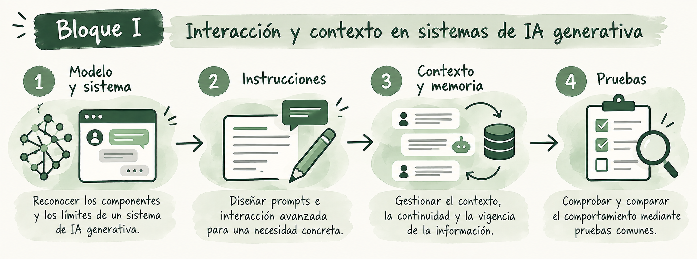

# Bloque I. Interacción y contexto en sistemas de IA generativa

Una interacción con un modelo generativo puede comenzar con una petición concreta. Diseñar un **sistema** exige además delimitar su función, decidir qué información recibe en cada momento y comprobar cómo responde cuando los datos cambian o son insuficientes. Este bloque presenta esas decisiones y permite ponerlas a prueba en dos actividades aplicadas.

**Dedicación estimada: 18 horas.** El reparto es orientativo y está incluido en el total de 75 horas de la microcredencial.

## Qué aprenderás a hacer

Al finalizar el bloque podrás distinguir un modelo de la aplicación que lo integra, diseñar instrucciones adecuadas a una necesidad concreta, decidir qué información debe formar parte del contexto en cada momento y comprobar si una interacción mantiene correctamente las decisiones vigentes. Las actividades permiten aplicar estos conceptos a un caso docente, investigador o profesional elegido por cada participante.

## Recorrido y dedicación

| Contenido | Propósito | Dedicación estimada |
|---|---|---:|
| [Tema 1. De los modelos generativos a los sistemas de IA](teoria/tema1-modelos-y-sistemas.md) | Reconocer los componentes y los límites de un sistema. | 3 h |
| [Tema 2. Diseño de prompts e interacción avanzada](teoria/tema2-prompts-e-interaccion.md) | Formular tareas, criterios y respuestas ante la ambigüedad. | 3 h |
| [Tema 3. Contexto, memoria y conversaciones](teoria/tema3-contexto-y-memoria.md) | Gestionar continuidad, estado y vigencia de la información. | 4 h |
| [Actividad 1. Diseño y evaluación de prompts](actividades/actividad1-prompts.md) | Comparar dos versiones mediante pruebas comunes. | 4 h |
| [Actividad 2. Construcción de una interacción contextual](actividades/actividad2-interaccion-contextual.md) | Probar una conversación de varios turnos con correcciones. | 4 h |
| **Total** | | **18 h** |

Las horas de cada tema incluyen la lectura de sus ejemplos enlazados. Las **ocho horas de actividades** se cuentan aparte: en ellas se produce y analiza el trabajo aplicado.

<strong>Cómo recorrer el bloque</strong>

Se recomienda leer los tres temas en orden y explorar sus ejemplos antes de abordar las actividades. La Actividad 1 puede realizarse tras el Tema 2; para la Actividad 2 es necesario haber estudiado también el Tema 3. Es posible utilizar el <strong>mismo caso</strong> en ambas y conservar lo aprendido como punto de partida del proyecto final. Los ejemplos de las páginas teóricas son materiales de análisis, mientras que las actividades indican las pruebas y evidencias que preparará cada participante.

<small><strong>Imagen.</strong> <em>Recorrido del Bloque I: del modelo y el sistema al diseño de instrucciones, la gestión del contexto y la comprobación mediante pruebas.</em></small>

## Conexión con el proyecto final

Al terminar el bloque se habrá delimitado una necesidad, probado una forma de interacción y observado qué información debe mantenerse o actualizarse. Estas decisiones pueden incorporarse al [proyecto final](../proyecto-final.md). Los bloques siguientes permitirán valorar si el caso necesita conocimiento externo, automatización u otros componentes antes de cerrar la arquitectura del prototipo.
