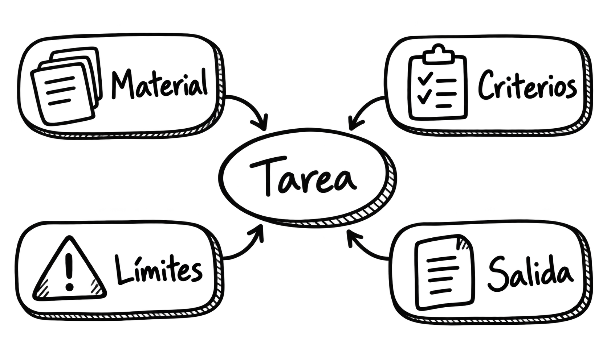

# Tema 2. Diseño de prompts e interacción avanzada

**Dedicación estimada: 3 horas.** Incluye la lectura, el análisis de dos ejemplos y pequeñas comprobaciones de comprensión. La [Actividad 1. Diseño y evaluación de prompts](../actividades/actividad1-prompts.md) dispone de cuatro horas adicionales y se desarrollará por separado.

| Recorrido | Tiempo orientativo |
|---|---:|
| 1. Del resultado deseado a una instrucción útil | 20 min |
| 2. Componentes de un prompt | 35 min |
| 3. Estrategias de diseño | 40 min |
| 4. Diseño de la interacción | 30 min |
| 5. Ejemplos y evaluación inicial | 40 min |
| 6. Síntesis y comprobación | 15 min |
| **Total** | **180 min** |

En el [Tema 1](tema1-modelos-y-sistemas.md) distinguimos el modelo de la aplicación que lo integra. Ahora examinaremos una de las decisiones más visibles para quien diseña esa aplicación: **qué instrucciones recibe el modelo y cómo se organiza el intercambio con la persona usuaria**. Un prompt puede ser un mensaje escrito en un chat o parte de una aplicación que construye mensajes a partir de datos. En ambos casos, su calidad depende de la tarea y del contexto, no de una fórmula universal.

**Al finalizar podrás** delimitar una tarea, redactar un prompt con información y criterios pertinentes, diseñar preguntas de aclaración cuando sean necesarias y analizar fallos antes de cambiar la instrucción.

## 1. Del resultado deseado a una instrucción útil

Una docente solicita: «Háblame de bases de datos». La respuesta podría ser correcta y, sin embargo, no servirle: quizá necesitaba una explicación para estudiantes sin experiencia, una comparación entre modelos de datos o un texto para introducir una práctica. El problema inicial no consiste en encontrar una palabra especial que active una respuesta perfecta. Consiste en especificar **qué trabajo se quiere realizar** y **para quién**.

Podríamos concretar: «Explica a estudiantes de primer curso qué diferencia una tabla de una base de datos. Usa un ejemplo de una biblioteca universitaria, limita la respuesta a dos párrafos y evita fórmulas». Aquí se aclaran la audiencia, el objeto, un ejemplo adecuado y la forma de la salida. Todavía habría que revisar si la explicación resultante es correcta, pero ya disponemos de un criterio para juzgar su utilidad.

<details>
<summary><strong>Antes de escribir: cuatro preguntas de diseño</strong></summary>

<p>1. ¿Qué producto concreto se espera: explicación, borrador, extracción de datos o comparación?</p>
<p>2. ¿Qué información necesita el modelo para hacerlo con fundamento?</p>
<p>3. ¿Qué debe hacer si la información no basta o la petición es ambigua?</p>
<p>4. ¿Cómo reconoceremos una salida aceptable?</p>

Es posible que, tras responderlas, el problema se resuelva mejor con un formulario, una búsqueda documental o una revisión humana. El prompt es una pieza del sistema, no el punto de partida obligatorio de toda solución.

</details>

## 2. Componentes de un prompt

Podemos pensar en un prompt como una **especificación de trabajo para una interacción concreta**. Según la tarea, tendrá algunos de los siguientes elementos:

| Elemento | Pregunta que responde | Ejemplo |
|---|---|---|
| Objetivo | ¿Qué hay que hacer? | «Compara dos definiciones». |
| Destinatario | ¿Para quién es la salida? | «Para alumnado que comienza la asignatura». |
| Material de entrada | ¿Con qué información? | «Usa los dos fragmentos incluidos debajo». |
| Alcance | ¿Qué queda incluido o excluido? | «No añadas afirmaciones externas a los fragmentos». |
| Criterios de calidad | ¿Qué hace útil el resultado? | «Señala una semejanza y dos diferencias verificables». |
| Formato | ¿Cómo se presentará? | «Tabla con tres columnas». |
| Tratamiento de la incertidumbre | ¿Qué hacer si falta información? | «Indica qué dato falta; no lo inventes». |

No es necesario incluir siempre los siete elementos. Un prompt puede ser breve si la tarea es simple. Añadir detalles irrelevantes puede dificultar la interpretación. Lo que buscamos es suficiente información para **reducir la ambigüedad significativa**, no alcanzar una longitud determinada.

### Una plantilla legible

La siguiente estructura sirve para planificar un prompt. Los corchetes son campos que se sustituirían por contenido real:

```text
Tarea: [acción concreta].
Destinatario y propósito: [quién usará el resultado y para qué].
Material disponible: [texto o datos aportados].
Criterios: [qué se debe conservar, comparar o justificar].
Límites: [qué evitar y qué hacer cuando falte información].
Salida: [extensión y formato adecuados].
```

Por ejemplo: «Reformula el siguiente aviso para estudiantes de nuevo ingreso. Conserva fechas y requisitos literalmente; usa lenguaje claro y no agregues trámites. Si alguna frase del aviso es ambigua, señálala después de la reformulación. Devuelve dos párrafos y una lista breve de dudas». Aquí el modelo puede ayudar a mejorar la comunicación, mientras que la responsabilidad sobre las fechas permanece en quien publica el aviso.

<details>
<summary><strong>¿Asignar un rol como «eres una experta» mejora siempre el resultado?</strong></summary>

Una indicación de perspectiva o función puede ayudar a definir tono y nivel: «Explica esto como material introductorio para estudiantes universitarios». Sin embargo, asignar una identidad no aporta documentos, competencias profesionales verificadas ni acceso a datos actuales. Es más útil describir la tarea y sus criterios que confiar en la autoridad aparente de un personaje.

</details>

<details>
<summary><strong>Cómo distinguir instrucciones de material que se analiza</strong></summary>

Si se facilita un texto para resumir, conviene introducirlo con una etiqueta como «Texto de entrada» y delimitar su principio y final. El sistema debe tratar ese texto como <strong>datos</strong>, aunque incluya frases con forma de órdenes. Los delimitadores hacen la petición más legible, pero no constituyen por sí solos una defensa suficiente frente a instrucciones maliciosas insertadas en documentos externos.

</details>

{ width="350" style="display:block; margin:auto;" }

<small><strong>Imagen.</strong> <em>Elementos que delimitan una tarea y orientan la respuesta del sistema.</em></small>

## 3. Estrategias de diseño

### 3.1. Delimitar la tarea y el criterio de éxito

«Mejora este texto» abre varias posibilidades: corregir errores, hacerlo más breve, cambiar el tono o modificar la estructura. Una petición mejor define la operación: «Reescribe este texto para que sea comprensible para alumnado de primer curso; conserva las tres condiciones de entrega y no cambies las fechas». El criterio de éxito no es solo que el texto suene mejor, sino que **mantenga las condiciones de entrega**.

Si la tarea contiene varias operaciones, ordenarlas ayuda: «Primero identifica los requisitos explícitos; después redacta una explicación sencilla; por último enumera las dudas que el documento no resuelve». Esto organiza la salida observable. No hace falta pedir al modelo que revele un razonamiento interno completo; para comprobar la respuesta son más útiles criterios verificables, fuentes y una justificación breve cuando proceda.

### 3.2. Aportar el material necesario y distinguirlo de las instrucciones

Pedir «resume la guía del curso» sin adjuntar o enlazar la versión vigente deja abierta la fuente. Si la persona introduce el fragmento en la conversación, debe indicar cuál es el texto que se resume y qué aspectos interesan. Si una aplicación recupera documentos automáticamente, la selección de esos fragmentos es una decisión del sistema estudiada más adelante, no una propiedad mágica del prompt.

Una formulación prudente sería: «Usa exclusivamente el fragmento delimitado para identificar los plazos que aparecen en él. Si no menciona un plazo, responde “No consta en el fragmento”». Pedirlo no garantiza obediencia perfecta: hay que comprobar la salida frente al material.

### 3.3. Mostrar uno o varios ejemplos cuando el patrón resulte difícil de explicar

Un ejemplo de entrada y salida puede enseñar el formato esperado. Supongamos que queremos transformar observaciones breves en comentarios formativos:

```text
EJEMPLO
Indicando ejemplos de entrada-salida
Ejemplo de entrada: «No se citan las fuentes».
Ejemplo de salida: «Añade las fuentes de los datos utilizados para que sea posible comprobar las afirmaciones».

NUEVA ENTRADA
Ahora reformula esta observación manteniendo su significado:
«La conclusión no se desprende de los resultados».
```

Esto se conoce como uso de ejemplos en el propio prompt. Son útiles cuando el tono o la transformación deseada no quedan claros con una instrucción general. La elección del ejemplo también puede introducir sesgos: si solo mostramos respuestas excesivamente largas, la salida puede imitar esa longitud. Conviene revisar que el ejemplo refleje de verdad el objetivo.

<details>
<summary><strong>¿Cuántos ejemplos hacen falta?</strong></summary>

No existe un número universal. Puede bastar una descripción clara sin ejemplos. Si la tarea tiene un formato poco habitual, se puede probar con uno y añadir otro que muestre un caso diferente. Cada ejemplo ocupa espacio en el contexto y puede inducir una generalización errónea. La decisión debe apoyarse en pruebas con entradas representativas.

</details>

### 3.4. Definir la forma de la respuesta sin confundir forma y verdad

Se puede solicitar una tabla, tres apartados, un resumen de cien palabras o un objeto con campos concretos. El formato facilita la lectura y la revisión, pero una tabla bien presentada puede contener errores. En una aplicación que deba procesar automáticamente la respuesta, un formato solicitado mediante texto libre puede no ser suficiente: cuando la plataforma ofrezca salidas estructuradas con validación, habrá que valorar esa opción y comprobar siempre los valores recibidos.

### 3.5. Preparar la respuesta cuando no hay base suficiente

«No inventes» es una instrucción útil, pero muy general. Conviene formular una conducta observable: «Si el fragmento no incluye la fecha, escribe “Fecha no indicada en el material facilitado” y explica brevemente dónde sería necesario consultarla». Después se prueban casos en los que el dato existe, no existe o es contradictorio. Reconocer el límite es parte de un buen resultado.

<details>
<summary><strong>Una estrategia que suele empeorar el prompt</strong></summary>

Acumular frases como «sé siempre preciso, completo, creativo, muy breve y exhaustivo» genera objetivos difíciles de conciliar. Es preferible priorizar: por ejemplo, exactitud de fechas y conservación de requisitos antes que elegancia del estilo. Si se necesitan dos productos distintos, puede ser más claro pedir dos salidas separadas.

</details>

## 4. Diseño de la interacción

Un sistema conversacional debe decidir **cuándo responder, cuándo pedir una aclaración y cuándo reconocer un límite**. Ante «Resume el informe», puede faltar el propio informe. Ante «¿Cuándo se entrega?», puede haber varias entregas. Ante «Haz que la calificación sea más justa», es posible que se necesiten criterios que el sistema no posee. Responder de inmediato a todas las peticiones crea la apariencia de fluidez, pero puede reducir la utilidad.

### Una regla sencilla para aclarar

Si una ambigüedad puede cambiar materialmente la respuesta, conviene preguntar lo mínimo necesario: «¿Te refieres a la memoria escrita o a la exposición oral?». Si la duda no afecta al resultado, es posible avanzar indicando el supuesto adoptado. El diseño de esta regla evita tanto una conversación interminable de preguntas como una respuesta apoyada en suposiciones ocultas.

La siguiente tabla muestra cómo puede traducirse este criterio en **reglas concretas de comportamiento**. La respuesta del sistema dependerá de qué información falte, de la importancia que tenga para resolver la tarea y de si la decisión puede tomarse dentro de los límites establecidos.

| Situación | Comportamiento esperado |
|---|---|
| Falta un documento imprescindible. | Solicitarlo antes de resumirlo. |
| Hay dos interpretaciones con consecuencias diferentes. | Plantear una pregunta de aclaración breve. |
| La petición está clara, pero falta un dato secundario. | Avanzar y señalar el supuesto. |
| La tarea requiere una decisión fuera del alcance del sistema. | Explicar el límite y derivar a quien corresponda. |

El objetivo no es que el sistema pregunte siempre que detecte una incertidumbre, sino que **distinga cuándo necesita detenerse y pedir información, cuándo puede continuar haciendo explícito un supuesto y cuándo debe reconocer que la decisión queda fuera de su alcance**. Estas reglas forman parte de las instrucciones con las que diseñamos su comportamiento.

En una aplicación, unas instrucciones generales pueden establecer el comportamiento del asistente y cada persona aportar después su petición y sus datos. Además, los documentos recuperados deben tratarse como información para analizar, no como órdenes que puedan reemplazar las instrucciones de la aplicación. La forma exacta de representar estos niveles depende de la plataforma; lo importante es mantener clara la distinción **instrucción / petición / dato externo**.

### Iterar con un propósito

Una interacción avanzada no consiste en añadir «hazlo mejor» una y otra vez. Conviene identificar el fallo y cambiar una cosa cada vez: destinatario mal definido, información ausente, criterio demasiado vago o formato poco útil. Se conserva un caso de prueba para observar si la revisión resolvió ese fallo sin introducir otro. Cuando el prompt se incorpora a una aplicación, conviene guardar sus versiones y las observaciones de las pruebas.

{ width="500" style="display:block; margin:auto;" }

<small><strong>Imagen.</strong> <em>Flujo de decisión ante información insuficiente, ambigüedad o peticiones fuera del alcance del sistema.</em></small>

<details>
<summary><strong>¿Y la memoria de una conversación larga?</strong></summary>

En este tema analizamos turnos de una interacción y la información necesaria para la tarea actual. La selección, conservación y recuperación del contexto entre turnos prolongados, así como las posibles memorias del sistema, se estudian en el <a href="../tema3-contexto-y-memoria">Tema 3: Contexto y memoria</a>.

</details>

## 5. Ejemplos desarrollados y evaluación inicial

Los siguientes archivos muestran cómo cambian el prompt y el comportamiento esperado al concretar una necesidad. Son **casos didácticos ficticios** y los fragmentos que presentan como posibles salidas no son resultados medidos de un modelo concreto.

1. [Ejemplo 1. Explicaciones docentes adaptadas a una audiencia](ejemplos/tema2-ejemplo1-explicacion-docente.md): reformulación progresiva de un prompt y contraste con criterios pedagógicos.
2. [Ejemplo 2. Extraer información de una convocatoria ficticia](ejemplos/tema2-ejemplo2-extraccion-convocatoria.md): separación de instrucciones y documento, definición de campos, datos ausentes y necesidad de revisión.

Después de revisar los ejemplos, podemos realizar una **primera evaluación de las respuestas** mediante un conjunto reducido de criterios. La siguiente tabla propone preguntas sencillas que permiten comprobar distintos aspectos del resultado sin limitar la evaluación a una impresión general.

| Criterio | Pregunta de comprobación |
|---|---|
| Adecuación | ¿Resuelve la necesidad de la persona destinataria? |
| Fidelidad | ¿Conserva los datos del material original? |
| Cobertura | ¿Incluye todos los elementos solicitados? |
| Manejo de incertidumbre | ¿Reconoce lo que no consta o es ambiguo? |
| Presentación | ¿Facilita revisar y utilizar el resultado? |

Utiliza estas preguntas para revisar las posibles salidas de los dos ejemplos anteriores e identifica en cada caso qué criterios resultan más relevantes y qué aspectos podrían mejorarse.

No todos los criterios tienen la misma importancia en todas las tareas. Si se extrae una fecha oficial, por ejemplo, la **fidelidad** es crucial; si se adapta una explicación a una audiencia concreta, tendrá especial relevancia la **adecuación**. Evaluar una respuesta implica, por tanto, seleccionar los criterios pertinentes para la necesidad planteada y comprobarlos de forma explícita.

## 6. Síntesis y comprobación

Diseñar un prompt significa formular una tarea con el material, los límites y las señales de calidad pertinentes. Diseñar la interacción añade decisiones sobre aclaraciones, seguimiento y tratamiento de casos que no se pueden resolver. Estas decisiones deben evaluarse en ejemplos concretos y pueden requerir componentes adicionales de la aplicación.

1. ¿Qué falta en «Resume el artículo» si la aplicación no tiene acceso al artículo?
2. ¿Por qué pedir una tabla no garantiza que los datos de la tabla sean correctos?
3. Si una pregunta admite dos respuestas distintas según lo que signifique «entrega», ¿qué debería hacer el sistema?
4. ¿Qué cambiarías primero si un prompt genera respuestas elegantes pero altera las fechas originales?

<details>
<summary><strong>Orientaciones para contrastar las respuestas</strong></summary>

<p>1. Falta el material de entrada: habría que aportarlo o pedirlo.</p>
<p>2. El formato organiza la salida; la veracidad exige contrastar los datos con la fuente.</p>
<p>3. Pedir una aclaración breve si la ambigüedad afecta de manera importante al contenido.</p>
<p>4. Precisar que conserve literalmente las fechas, incluir el texto fuente y comprobarlas mediante casos de prueba. Si el problema persiste, añadir un control externo a la generación.</p>

</details>

**Para continuar:** la [Actividad 1](../actividades/actividad1-prompts.md) permitirá diseñar, comparar y revisar propuestas de interacción. El [Tema 3](tema3-contexto-y-memoria.md) abordará qué información conservar cuando la conversación se prolonga.

### Lecturas de referencia y ampliación

- [ChatGPT: Ingeniería de Prompts](https://mltechdrawer.github.io/ChatGPT/2_IP/). Material docente anterior con anatomía, tipos y técnicas de prompting; este tema selecciona los fundamentos necesarios para diseñar un sistema.
- [Competencia Digital e IA Aplicada: diseño de workflows](https://mltechdrawer.github.io/CompetenciaDigitalIA/bloque2/sesion4/). Relaciona interacciones puntuales con procesos organizados.
- [Google AI for Developers: estrategias de diseño de instrucciones](https://ai.google.dev/gemini-api/docs/prompting-strategies?hl=es). Documentación técnica con ejemplos de instrucciones, formatos y aportación de material.
- [Anthropic: buenas prácticas de prompting](https://docs.anthropic.com/en/docs/build-with-claude/prompt-engineering/prompt-templates-and-variables). Referencia complementaria para claridad, estructura y ejemplos.

[Volver a la presentación del bloque](../index.md)
