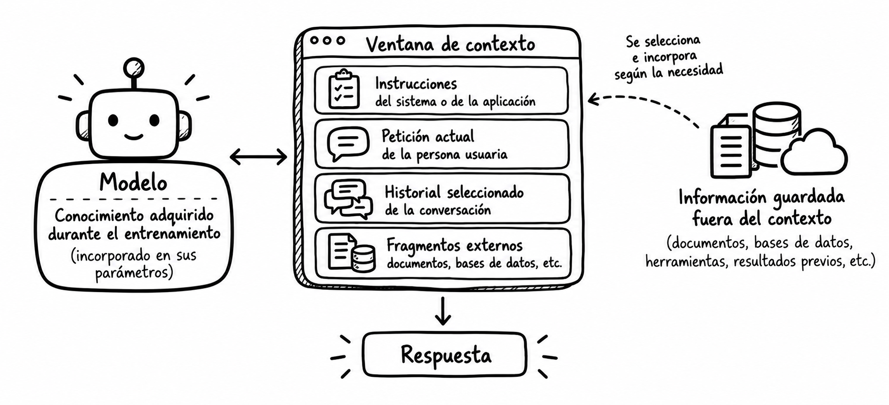

# Tema 3. Contexto, memoria y conversaciones

**Dedicación estimada: 4 horas.** Comprende lectura guiada, análisis de dos casos y preguntas de comprobación. La [Actividad 2. Construcción de una interacción contextual](../actividades/actividad2-interaccion-contextual.md) tiene otras cuatro horas y se desarrollará posteriormente.

| Recorrido | Tiempo orientativo |
|---|---:|
| 1. La respuesta depende de lo que el sistema conoce ahora | 25 min |
| 2. Qué información puede formar parte del contexto | 40 min |
| 3. Conversación, estado y memoria | 45 min |
| 4. Seleccionar, actualizar y condensar información | 45 min |
| 5. Dos ejemplos desarrollados | 60 min |
| 6. Síntesis y comprobación | 25 min |
| **Total** | **240 min** |

En el [Tema 2](tema2-prompts-e-interaccion.md) aprendimos a formular la tarea y decidir cuándo pedir una aclaración. Sin embargo, un buen prompt puede fallar si faltan datos esenciales, se utiliza un documento antiguo o se pierde una decisión tomada cinco mensajes antes. Diseñar una conversación útil exige determinar **qué información debe estar disponible en cada turno, de dónde procede y cuánto tiempo conserva su validez**.

**Al finalizar podrás** distinguir contexto, historial, estado y memoria; explicar las limitaciones de una ventana de contexto; comparar estrategias para mantener la continuidad de una conversación; y reconocer cuándo debe verificarse o descartarse información previa.

## 1. La respuesta depende de lo que el sistema conoce ahora

Imaginemos un asistente para preparar el programa de una asignatura. La docente le indica al principio: «El grupo está formado por estudiantes de segundo curso y la asignatura dura seis semanas». Unos mensajes después pide: «Propón el plan de la semana 4». Si la aplicación incluye aquella información en la nueva petición, el modelo puede ajustar el plan. Si no la incluye, quizá produzca un programa genérico o haga una suposición errónea.

El hecho de que la conversación se vea completa en pantalla **no demuestra por sí solo** que el modelo reciba todos los mensajes cada vez que responde. La aplicación decide cómo gestionar los turnos y qué material enviar o recuperar. Algunas plataformas mantienen estado de conversación; otras requieren que la aplicación aporte el historial, seleccione fragmentos o transmita una referencia a un estado gestionado por el servicio. El comportamiento exacto depende de la implementación.

<strong>Pregunta inicial: ¿qué necesita saber realmente para planificar la semana 4?</strong>

Necesita el nivel del grupo, la duración total, el objetivo de aprendizaje, los contenidos ya tratados y las decisiones vigentes que afecten a esa semana. Probablemente no necesita conservar cada saludo ni todas las versiones descartadas de un ejemplo. Seleccionar el contexto consiste en decidir qué información influye materialmente en la respuesta.

La [Ingeniería de Contexto](https://mltechdrawer.github.io/ChatGPT/3_IC/) introduce esta idea. Aquí avanzamos desde la definición hacia decisiones concretas sobre conversaciones y memoria de un sistema.

## 2. Qué información puede formar parte del contexto

En términos prácticos, llamaremos **contexto de una petición** a la información disponible para que el modelo responda a esa petición. Puede contener instrucciones de la aplicación, la pregunta actual, partes de la conversación, documentos seleccionados y resultados de herramientas. Su composición puede variar entre turnos.

El contexto que recibe el modelo puede estar formado por **distintos tipos de información**, cada uno con una función y una vigencia diferentes. La siguiente tabla muestra algunos de los elementos que pueden formar parte de ese contexto y plantea, para cada uno, una pregunta de diseño que ayuda a decidir si debe incorporarse en un turno concreto.

| Elemento | Ejemplo | Pregunta de diseño |
|---|---|---|
| Instrucciones generales | «Explica requisitos usando solo fuentes autorizadas». | ¿Siguen vigentes para esta tarea? |
| Solicitud actual | «¿Qué debo entregar esta semana?». | ¿Es suficientemente precisa? |
| Historial seleccionado | «Nos referimos al proyecto grupal». | ¿Qué mensajes previos son relevantes? |
| Estado estructurado | `tipo_trabajo: grupal`; `semana: 4`. | ¿Quién lo actualiza si cambia el plan? |
| Datos de usuario autorizados | Preferencia de idioma o nivel de detalle. | ¿Es necesario conservarlos? |
| Fuentes externas | Guía docente del curso actual. | ¿Es la versión correcta y está disponible? |
| Resultado de una herramienta | Calendario o consulta a una base de datos. | ¿Cuándo se obtuvo y puede haber cambiado? |

Estos elementos no tienen que estar presentes en todas las interacciones. **Diseñar el contexto consiste también en seleccionar qué información necesita realmente el modelo en cada momento**, comprobar que sigue siendo válida y evitar conservar o incorporar datos que no aportan valor a la tarea. Por ello, el contexto puede cambiar de un turno a otro aunque el sistema y sus instrucciones generales permanezcan iguales.

Como indicamos anteriormente la tabla no significa que haya que incluirlo todo en cada llamada al modelo. La selección depende de la pregunta. Para aclarar un término bastaría una definición breve y el nivel del alumnado; para indicar la fecha oficial de entrega haría falta la fuente adecuada.

### La ventana de contexto

Cada modelo admite una cantidad máxima de información por petición, normalmente expresada en tokens. La llamada puede incluir entrada y espacio para generar la salida; la contabilización exacta depende de la plataforma y del modelo. La **ventana de contexto** no es una memoria permanente: es un límite de lo que el modelo puede procesar en una interacción. Si una conversación excede ese límite, la aplicación debe decidir cómo gestionar lo anterior, y algunas plataformas pueden truncar o condensar el historial según su configuración.

Una ventana amplia permite aportar documentos extensos, pero no garantiza que toda la información sea necesaria ni que el modelo identifique siempre el fragmento correcto. Incluir diez versiones de la misma guía puede hacer más difícil saber cuál es la vigente. La pregunta útil no es solo «¿cabe?», sino «¿qué aporta y cómo sabemos que es la versión correcta?».

<strong>¿El conocimiento adquirido durante el entrenamiento es contexto?</strong>

En este tema reservamos «contexto» para la información disponible en la petición o incorporada mediante mecanismos de la aplicación. Los parámetros aprendidos por un modelo durante su entrenamiento son algo distinto. Pueden ayudarle a redactar y relacionar conceptos, pero no sustituyen la aportación y verificación de información específica o actual.

<strong>¿Adjuntar un archivo equivale a que el modelo consulte cada línea?</strong>

No necesariamente. La plataforma puede proporcionar el archivo íntegro, extraer su texto, seleccionar fragmentos o aplicar otro tratamiento. Incluso si todo cabe en la ventana, hay que comprobar que la respuesta se apoye en el pasaje pertinente. Conviene distinguir el documento disponible en el sistema del fragmento que llega efectivamente al modelo para responder.

<strong>💡 Metáfora · Lo que sabes y lo que tienes sobre la mesa</strong>

Imagina a una persona preparando un informe. Por una parte, posee conocimientos adquiridos durante años de estudio y experiencia. Esto se parece al <strong>conocimiento adquirido durante el entrenamiento</strong>: patrones, relaciones y regularidades aprendidos por el modelo durante su entrenamiento y reflejados en sus parámetros.

Por otra parte, para preparar ese informe la persona coloca sobre su mesa instrucciones, notas y documentos concretos. Esa información disponible para realizar la tarea actual representa el <strong>contexto</strong>: aquello que se proporciona al modelo en una interacción para ayudarle a generar la respuesta.

Pero tener un documento sobre la mesa tampoco significa haber utilizado todas sus páginas. Puede consultarse solo el capítulo necesario o determinados fragmentos. Del mismo modo, que un archivo esté disponible en una aplicación no implica necesariamente que <strong>todo su contenido forme parte del contexto que recibe el modelo</strong>.

{ width="550" style="display:block; margin:auto;" }

<small><strong>Imagen.</strong> <em>Relación entre el conocimiento adquirido durante el entrenamiento, la ventana de contexto y la información disponible fuera de ella.</em></small>

## 3. Conversación, estado y memoria

Una conversación se compone de turnos, pero no todas las decisiones relevantes deben deducirse una y otra vez de un historial de texto. Conviene separar tres cosas:

1. **Historial conversacional:** mensajes intercambiados, potencialmente útiles para interpretar referencias como «hazlo más breve».
2. **Estado de la tarea:** hechos y decisiones vigentes que la aplicación necesita para continuar, por ejemplo «documento elegido: guía 2026–2027» o «formato aprobado: tabla».
3. **Memoria entre sesiones:** datos que el sistema decide conservar para usos posteriores, como una preferencia de idioma autorizada. Su persistencia y alcance deben definirse expresamente.

Un sistema puede conservar el historial completo en un almacenamiento y, sin embargo, enviar al modelo solo los últimos turnos más un estado resumido. Otro puede no guardar nada entre sesiones. **Almacenado** no significa **visible en el contexto actual**, y **visible ahora** no significa **guardado para el futuro**.

Decidir qué información debe conservarse entre interacciones es también una **decisión de diseño**. No todo lo utilizado durante una conversación necesita persistir: algunos datos pueden ser útiles en futuras interacciones, mientras que otros solo tienen sentido para resolver la tarea actual. La siguiente tabla muestra esta diferencia en varias situaciones.

| Situación | Información que podría persistir | Información que quizá no hace falta conservar |
|---|---|---|
| Redacción de una guía | Público, estructura aprobada y secciones pendientes. | Versiones de frases ya descartadas. |
| Consulta de una norma | Identificador y fecha de la fuente vigente. | Conversaciones ajenas a la pregunta actual. |
| Apoyo a una clase | Nivel del grupo y formato preferido, si procede. | Datos personales innecesarios del alumnado. |

La persistencia debe responder, por tanto, a una **necesidad concreta** y no a la idea de conservar toda la interacción. Diseñar qué se guarda implica decidir qué información seguirá siendo útil, durante cuánto tiempo y con qué finalidad. Además, que un dato se conserve no significa que deba incorporarse automáticamente al contexto de las siguientes interacciones.

### Memoria de la tarea y memoria de la persona

Una decisión del proyecto, como «el informe se presentará en español», no equivale a una característica permanente de la persona usuaria. Conservar ambas como una única «preferencia» puede producir errores en proyectos futuros. Hay que indicar **a qué tarea pertenece cada dato**, quién puede modificarlo, cuándo caduca y en qué situaciones no debe reutilizarse.

<strong>¿Una memoria persistente significa que el modelo aprendió algo nuevo?</strong>

Habitualmente, la aplicación almacena el dato fuera del modelo y puede volver a incluirlo en peticiones posteriores. Esto es distinto de modificar los parámetros del modelo mediante entrenamiento. La palabra «memoria» se utiliza de distintas maneras en distintos productos; para diseñar conviene describir el mecanismo concreto: almacenamiento, recuperación y uso del dato.

### Correcciones y cambios de decisión

Supongamos que se decide primero una sesión de 90 minutos y después se corrige a 60. El sistema no debe repetir ambas duraciones como igualmente válidas. Tiene que actualizar el estado o resolver explícitamente el conflicto. Una forma legible de representarlo sería «Duración vigente: 60 min; decisión anterior: 90 min, sustituida». Las correcciones deberían tener prioridad sobre las versiones antiguas y, cuando importan las fechas, conviene conservar su procedencia.

El mismo criterio se aplica a preferencias y datos guardados: debe existir un modo de corregirlos y, cuando corresponda, eliminarlos. En contextos académicos o profesionales, la selección de datos conservados debe ajustarse a la finalidad del servicio y a las normas aplicables. En este tema nos centramos en la decisión de diseño; las reglas de protección de datos se estudiarán en los materiales específicos que correspondan.

## 4. Seleccionar, actualizar y condensar información

Cuando una interacción se prolonga, es necesario decidir **qué información mantener disponible y de qué forma hacerlo**. No existe una estrategia universal para gestionar conversaciones largas: conservar los últimos turnos, mantener un estado estructurado, resumir el historial o recuperar información externa responde a necesidades diferentes. La siguiente tabla compara estas estrategias y algunas de sus principales limitaciones.

| Estrategia | Cuándo ayuda | Limitación que debe vigilarse |
|---|---|---|
| Últimos turnos | Ajustes inmediatos como «hazlo más breve». | Pierde decisiones importantes más antiguas. |
| Historial completo, si cabe | Revisar cómo se llegó a una decisión. | Aumenta volumen y puede incluir contradicciones. |
| Estado estructurado | Mantener hechos y decisiones identificables. | Debe actualizarse cuando cambian. |
| Resumen de conversación | Continuar un trabajo extenso. | Puede omitir matices o convertir una hipótesis en un hecho. |
| Recuperación de documentos | Aportar fuentes externas pertinentes. | Depende de seleccionar versión y fragmento correctos. |

La elección no tiene por qué reducirse a una única estrategia. Un sistema puede, por ejemplo, conservar los últimos turnos para mantener la continuidad inmediata y, al mismo tiempo, utilizar un estado estructurado para preservar decisiones importantes. Lo relevante es **seleccionar, actualizar y condensar la información sin perder aquello que resulta necesario para la tarea**.

La recuperación de documentos tendrá su desarrollo propio en el Bloque II. Aquí interesa entender que es una forma de **aportar contexto externo**, no de convertir una conversación en una memoria perfecta.

### Qué conservar en un resumen

Una síntesis útil debería separar al menos **hechos confirmados**, **decisiones vigentes**, **dudas abiertas**, **fuentes** y **siguiente paso**. Si un dato proviene de una guía, registrar versión y apartado ayuda a revisarlo después. Si la profesora expresó una preferencia solo para una actividad, no hay que transformarla en regla para todo el curso.

Un resumen puede ahorrar espacio, pero es una transformación con pérdida de información: se decide qué omitir. Por eso conviene conservar un enlace al original cuando sea necesario, comprobar los puntos críticos y ofrecer la posibilidad de corregir la síntesis. Una frase como «el proyecto debe durar cuatro semanas» podría ser incorrecta si en la conversación se dijo «quizá cuatro semanas, aún por confirmar».

<strong>Ejemplo · Cuando resumir una conversación cambia una decisión</strong>

En una conversación larga, la aplicación puede decidir no mantener todo el historial en el contexto. Para reducirlo, puede <strong>utilizar un modelo para generar un resumen de los mensajes anteriores</strong>, conservar ese resumen y proporcionarlo como contexto en interacciones posteriores.

  

<strong>Conversación original:</strong> 
«Podríamos trabajar con grupos de tres, pero confirmaré el número cuando conozca la matrícula».

  

A partir de la conversación, el modelo genera este resumen: 
«Los grupos serán de tres estudiantes».

  

El resumen es incorrecto porque <strong>transforma una posibilidad pendiente de confirmación en una decisión definitiva</strong>. Si la aplicación conserva este resumen y lo utiliza posteriormente como contexto, el modelo que genere una nueva respuesta podría no recibir la conversación original. Solo sabrá que «los grupos serán de tres estudiantes» porque esa es la información que se le ha proporcionado.

  

Un <strong>resumen fiel</strong> conservaría también la incertidumbre de la conversación original: 
«Se propone trabajar con grupos de tres estudiantes, pendiente de confirmación cuando se conozca la matrícula».

  

Este ejemplo muestra por qué <strong>condensar el contexto no consiste únicamente en hacerlo más breve</strong>: el resumen debe conservar los hechos, las decisiones y también aquello que todavía está pendiente o es incierto.

<strong>¿Qué puede hacer la persona usuaria?</strong>

La persona usuaria no siempre controla cómo una aplicación selecciona o resume el historial, pero puede reducir el riesgo de pérdida o distorsión de información. Conviene <strong>hacer explícitas las decisiones importantes, señalar claramente qué información es provisional y corregir cualquier interpretación errónea cuando aparezca</strong>. En conversaciones largas también puede ser útil pedir al sistema que indique qué decisiones, restricciones y asuntos pendientes está teniendo en cuenta antes de continuar.

### Procedencia, vigencia y relevancia

Tres preguntas ayudan a decidir qué entra en el contexto:

- **Procedencia:** ¿lo dijo la persona responsable, figura en un documento vigente o lo infirió el modelo?
- **Vigencia:** ¿sigue siendo cierto para esta sesión, este proyecto y este curso?
- **Relevancia:** ¿puede cambiar materialmente la respuesta actual?

Un dato puede ser correcto y, aun así, resultar perjudicial si pertenece a otro proyecto. También puede ser pertinente pero no estar confirmado. Para información sensible o compartida, hay que verificar además quién está autorizado a acceder a ella. El diseño del contexto incluye una política de **inclusión y exclusión**, no solo la acumulación de datos.

{ width="400" style="display:block; margin:auto;" }

<small><strong>Imagen.</strong> <em>Gestión del contexto mediante la selección, actualización y condensación de la información relevante.</em></small>

## 5. Dos ejemplos desarrollados

Los ejemplos permiten seguir las decisiones de contexto a través de varios turnos. Son **escenarios ficticios**; las posibles respuestas están redactadas para ilustrar el análisis, no son pruebas de rendimiento de un modelo comercial.

1. [Ejemplo 1. Planificar una sesión en varios turnos](ejemplos/tema3-ejemplo1-planificacion-sesion.md). Muestra cómo conservar y corregir decisiones sobre público, tiempo y objetivo.
2. [Ejemplo 2. Responder con unas instrucciones que cambian de versión](ejemplos/tema3-ejemplo2-instrucciones-vigentes.md). Muestra por qué historial, memoria y documento autorizado no son equivalentes.

Para cada caso, identifica qué información proviene de la petición actual, cuál del estado de la tarea, cuál de una fuente externa y qué dato debe dejar de utilizarse tras una corrección.

## 6. Síntesis y comprobación

La continuidad conversacional no consiste en conservar indiscriminadamente mensajes. Consiste en aportar a cada petición la información **necesaria, autorizada, vigente y distinguible por procedencia**. Una memoria persistente requiere decidir qué se guarda, cuándo se recupera y cómo se corrige. Los resúmenes y la recuperación ayudan a administrar conversaciones extensas, siempre que se comprueben sus pérdidas y posibles conflictos.

1. Si la conversación está guardada íntegra en una base de datos, ¿puede el modelo conocer todos sus mensajes sin que se le proporcionen?
2. ¿Qué diferencia una preferencia válida solo para un proyecto de una preferencia que la persona desea mantener entre proyectos?
3. ¿Qué error aparece si el resumen convierte «posible fecha» en «fecha definitiva»?
4. Cuando una guía nueva contradice una respuesta dada hace dos semanas, ¿qué fuente debe revisarse antes de contestar?
5. ¿Por qué una ventana de contexto amplia no sustituye la selección de documentos pertinentes?

<strong>Orientaciones para contrastar las respuestas</strong>

1. No: almacenar el historial y hacerlo disponible en una petición son decisiones distintas.

2. Su alcance y su persistencia. No debe reutilizarse automáticamente en otro proyecto una decisión local.

3. Se pierde el grado de certeza y el sistema puede comunicar como oficial algo pendiente de confirmar.

4. La guía vigente y su versión autorizada; la respuesta anterior puede servir para detectar el conflicto, no para decidir la nueva fecha.

5. Porque caber en la ventana no hace que todos los fragmentos sean relevantes, actuales ni fáciles de distinguir.

**Para continuar:** la [Actividad 2](../actividades/actividad2-interaccion-contextual.md) permitirá diseñar una interacción que seleccione y actualice información de forma razonada. Los sistemas que incorporan documentos externos se estudiarán en el [Bloque II](../../bloque2/index.md).

### Lecturas para ampliar

- [Ingeniería de Contexto](https://mltechdrawer.github.io/ChatGPT/3_IC/). Introducción docente a relevancia, claridad, actualización y economía del contexto.
- [OpenAI: gestión del estado de una conversación](https://developers.openai.com/api/docs/guides/conversation-state). Ejemplos técnicos de historial, estado y límites de contexto.
- [OpenAI: compactación del contexto](https://developers.openai.com/api/docs/guides/compaction). Ejemplo de cómo una plataforma administra conversaciones extensas.
- [Google AI for Developers: contexto largo](https://ai.google.dev/gemini-api/docs/long-context). Capacidades y consideraciones de diseño en peticiones con gran cantidad de material.

[Volver a la presentación del bloque](../index.md)
