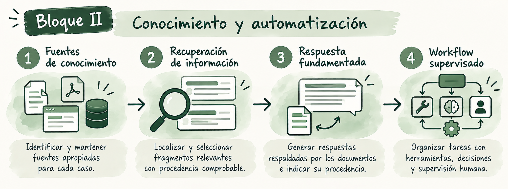

# Bloque II. Conocimiento y automatización

En el Bloque I se diseñaron interacciones y se gestionó su contexto. Ahora abordaremos dos capacidades que amplían el sistema: **consultar conocimiento externo con procedencia comprobable** y **organizar tareas en un flujo con herramientas, decisiones y supervisión**. El objetivo no es acumular componentes, sino escoger los que necesita cada caso.

**Dedicación estimada: 20 horas.** El reparto es orientativo y está incluido en el total de 75 horas de la microcredencial.

## Qué aprenderás a hacer

Al finalizar el bloque podrás seleccionar y mantener fuentes apropiadas, recuperar información relevante, comprobar si una respuesta está respaldada por los documentos y diseñar un workflow que combine herramientas, decisiones y supervisión humana. Las actividades permiten aplicar estas capacidades mediante pequeños prototipos y comprobar su comportamiento tanto en situaciones normales como ante fallos.

## Recorrido y dedicación

| Contenido | Propósito | Dedicación estimada |
|---|---|---:|
| [Tema 4. Incorporación y recuperación de conocimiento](teoria/tema4-conocimiento-externo.md) | Elegir fuentes y localizar evidencia pertinente. | 3 h |
| [Tema 5. Sistemas RAG y generación basada en conocimiento](teoria/tema5-sistemas-rag.md) | Integrar recuperación, generación y procedencia. | 4 h |
| [Tema 6. Automatización, herramientas y workflows con IA](teoria/tema6-automatizacion.md) | Organizar pasos, herramientas y controles. | 4 h |
| [Actividad 3. Prototipo basado en conocimiento](actividades/actividad3-prototipo-con-conocimiento.md) | Construir y probar respuestas con fuentes verificables. | 5 h |
| [Actividad 4. Workflow con IA](actividades/actividad4-workflow.md) | Diseñar y probar un flujo con revisión humana. | 4 h |
| **Total** | | **20 h** |

Las **11 horas de temas** incluyen la lectura y análisis de los ejemplos enlazados. Las **9 horas de actividades** corresponden a trabajo aplicado adicional.

<strong>Cómo recorrer el bloque</strong>

Se recomienda estudiar los Temas 4 y 5 antes de realizar la Actividad 3; después, el Tema 6 conduce a la Actividad 4. El caso definido en el Bloque I puede mantenerse, siempre que tenga sentido añadir fuentes o un flujo de tareas. La Actividad 3 incluye documentos ficticios para poder realizarla sin aportar materiales propios. La Actividad 4 permite representar herramientas externas sin ejecutarlas en servicios reales.

<small><strong>Imagen.</strong> <em>Recorrido del Bloque II: de la selección de fuentes y recuperación de información a la generación de respuestas fundamentadas y la construcción de workflows supervisados.</em></small>

## Conexión con el proyecto final

El prototipo basado en conocimiento y el workflow pueden aportar componentes al [proyecto final](../proyecto-final.md). Su incorporación dependerá del problema elegido y de los resultados de las pruebas. En el [Bloque III](../bloque3/index.md) se abordará la integración y evaluación del sistema completo.
