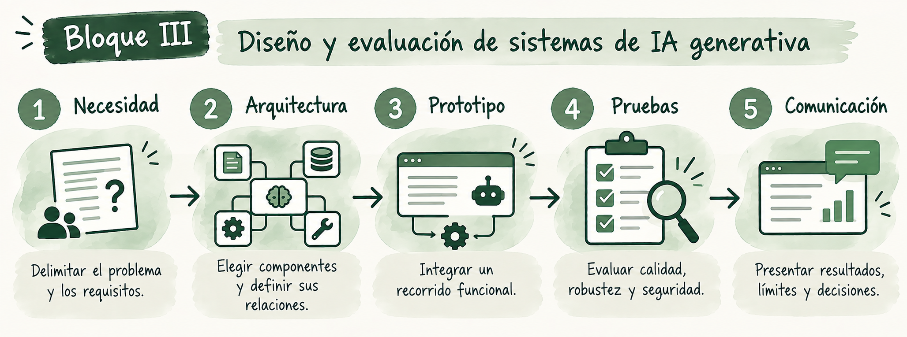

# Bloque III. Diseño y evaluación de sistemas de IA generativa

Este bloque reúne las capacidades estudiadas para diseñar un sistema con un propósito concreto. Se parte de una necesidad profesional, se eligen los componentes que la resuelven, se integra un recorrido funcional y se comprueba cómo responde ante casos ordinarios y fallos. El [proyecto final](../proyecto-final.md) permite profundizar en una propuesta propia y comunicar sus resultados.

**Dedicación estimada: 31 horas.** El reparto es orientativo y está incluido en el total de 75 horas de la microcredencial.

## Qué aprenderás a hacer

Al finalizar podrás diseñar y explicar una arquitectura de IA generativa ajustada al caso de uso, seguir la procedencia de las respuestas y acciones, preparar pruebas para valorar calidad, robustez y seguridad, y comunicar con honestidad qué ha funcionado y qué permanece sin verificar.

## Recorrido y dedicación

| Contenido | Propósito | Dedicación estimada |
|---|---|---:|
| [Tema 7. Arquitectura e integración de sistemas de IA generativa](teoria/tema7-arquitectura-e-integracion.md) | Elegir componentes y definir su relación. | 3 h |
| [Tema 8. Calidad, robustez, seguridad y evaluación](teoria/tema8-calidad-y-evaluacion.md) | Diseñar criterios, pruebas y controles. | 4 h |
| [Actividad 5. Integración y plan de evaluación](actividades/actividad5-integracion.md) | Ensayar un recorrido integrado y diagnosticar un fallo. | 6 h |
| [Proyecto final](../proyecto-final.md) | Desarrollar y evaluar el caso aplicado; preparar su comunicación. | 18 h |
| **Total** | | **31 h** |

Las **7 horas de temas** incluyen sus ejemplos enlazados. Las **6 horas de la actividad** y las **18 horas del proyecto** son dedicaciones distintas. El proyecto puede aprovechar las decisiones y resultados anteriores, pero su tiempo se dedica al desarrollo, evaluación y comunicación adicionales.

<strong>Cómo recorrer el bloque</strong>

Se recomienda estudiar los Temas 7 y 8 antes de realizar la Actividad 5. Esta actividad permite ensayar un caso y detectar qué debe mejorarse. Después se delimita la versión final del prototipo, se amplían las pruebas y se prepara la comunicación del proyecto. No todos los proyectos necesitan memoria, RAG y automatización a la vez: cada componente debe estar justificado por la necesidad elegida.

<small><strong>Imagen.</strong> <em>Recorrido del Bloque III: de la delimitación de la necesidad al diseño de la arquitectura, la integración del prototipo, su evaluación y la comunicación de los resultados.</em></small>

## Presentación del trabajo

El proyecto final prevé un **informe breve** y una **presentación oral de 10–15 minutos**. La preparación de ambos está incluida en las 18 horas del proyecto. Las **6 horas de evaluación y cierre** que se muestran en [Inicio](../index.md) son una parte distinta de la planificación general y no se suman de nuevo a este bloque.
